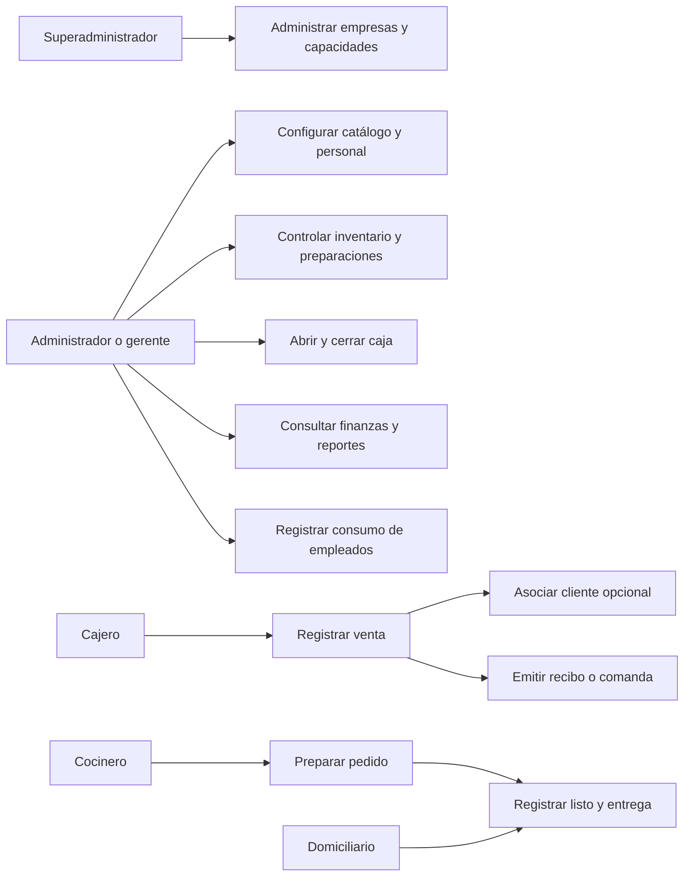
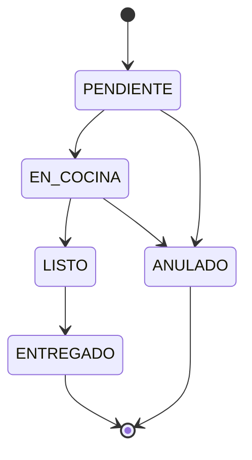

# 03. Casos de uso y procesos

Los siguientes flujos describen el uso previsto y señalan excepciones de la implementación. Actor autorizado significa autorización que debe comprobarse en servidor; la visibilidad del menú no basta.

## Mapa de casos de uso



Mapa funcional representado como diagrama de flujo; no pretende ser notación UML estricta.

## CU-01. Iniciar sesión

**Actor:** usuario registrado. **Requisito:** RF-01. **Precondición:** API y base disponibles, usuario activo.

1. Abrir `/login` e ingresar correo y contraseña.
2. El servidor busca usuario y verifica su estado, el de empresa y el hash.
3. Devuelve token de ocho horas y perfil.
4. La aplicación guarda sesión y dirige a la pantalla correspondiente.

**Alternativa:** datos incorrectos o empresa inactiva producen rechazo; SUPERADMIN tiene excepción al bloqueo empresarial en login. **Resultado:** sesión iniciada. **Límite:** la estrategia JWT reconstruye identidad desde token y no vuelve a consultar actividad en cada petición.

## CU-02. Preparar catálogo

**Actor previsto:** administrador. **Requisitos:** RF-05 a RF-07, RF-15. **Precondición:** empresa y categorías creadas.

1. Crear ingredientes con unidades y stock.
2. Crear categoría o subcategoría.
3. Crear producto y definir precio, disponibilidad e ingredientes con cantidades.
4. Configurar adicionales y su consumo opcional de ingrediente.
5. Consultar el producto en POS.

**Alternativa:** producto no disponible no debe venderse. **Resultado:** catálogo operativo. **Límite:** los ingredientes son globales en el modelo actual; no tratarlos como inventario aislado de cada empresa.

## CU-03. Abrir caja

**Actor previsto:** administrador o gerente. **Requisitos:** RF-09, RF-13, RF-14. **Precondición:** sucursal y usuario responsable activos.

1. Abrir Dashboard y seleccionar apertura.
2. Indicar monto base y cajero.
3. El servidor valida base no negativa y ausencia de caja abierta.
4. Crea caja, evento y solicita notificación.

**Alternativas:** caja ya abierta o cajero inexistente: rechazo. **Resultado:** caja disponible para ventas. **Límite:** la restricción de actor no está declarada mediante RolesGuard en este controlador; existe brecha de autorización.

## CU-04. Registrar venta

**Actor:** cajero asignado o supervisor. **Requisitos:** RF-07 a RF-10, RF-18, RF-19. **Precondición:** caja abierta, productos activos y sucursal de la empresa.

1. Elegir productos, cantidades, exclusiones y adicionales.
2. Asociar cliente si corresponde y elegir método de pago.
3. Enviar pedido.
4. El servidor valida caja, sucursal, cliente, producto y adicionales; calcula importes.
5. Guarda pedido y detalles, descuenta stock, crea ingreso y suma puntos.
6. Emite evento, solicita notificación y devuelve pedido.
7. La interfaz gestiona recibo, comanda y cajón según configuración.

**Alternativas:** caja cerrada, vendedor no autorizado, producto indisponible o adicional ajeno: rechazo. **Resultado normal:** venta identificada por número. **Integridad:** pedido, stock, ingreso, canje y acumulación se guardan en una transacción. Si se pierde la respuesta de una venta POS, consultar antes de repetirla: su endpoint aún no tiene clave de idempotencia.

## CU-05. Preparar y entregar

**Actor:** cocinero o personal autorizado. **Requisitos:** RF-11, RF-12, RF-22. **Precondición:** pedido registrado.

1. Consultar cocina y revisar cantidades, exclusiones y extras.
2. Marcar preparación, luego listo.
3. Activar llamado al cliente cuando corresponda.
4. Entregar y registrar ENTREGADO.

**Alternativa:** si falla SSE, la cocina vuelve a consultar cada cinco segundos. **Resultado:** estado actualizado. **Límites:** transiciones no validadas como máquina de estados; pantallas de llamado usan comunicación del navegador, no un canal entre equipos.

## CU-06. Ajustar inventario

**Actor previsto:** administrador o gerente. **Requisito:** RF-15. **Precondición:** ingrediente registrado.

1. Consultar stock e historial.
2. Elegir ENTRADA, SALIDA o AJUSTE e indicar cantidad y descripción.
3. Indicar si la cantidad se expresa en unidad de compra.
4. El servicio aplica factor si corresponde; entrada suma, salida resta y ajuste sustituye saldo.
5. Guarda stock, movimiento y evalúa alerta.

**Resultado:** nuevo saldo e historial. **Límite:** no se garantiza rechazo de stock negativo ni transacción entre saldo y movimiento.

## CU-07. Registrar lote

**Actor previsto:** responsable de inventario. **Requisitos:** RF-16, RF-17. **Precondición:** preparación existente.

1. Definir preparación y receta.
2. Registrar lote por API con producción y porciones positivas, fecha e insumos efectivamente usados.
3. El servidor crea lote y detalle; descuenta ingredientes y registra movimientos y auditoría.
4. Consultar lotes y porciones reportadas.

**Resultado:** producción registrada. **Límite:** API de lotes observada; no se identificó un formulario de captura de lotes en la pantalla de inventario revisada. Las porciones disponibles suman lo producido, sin descontar ventas.

## CU-08. Cerrar caja

**Actor previsto:** administrador o gerente. **Requisitos:** RF-13, RF-14. **Precondición:** caja ABIERTA.

1. Revisar ventas y monto esperado en Dashboard.
2. Ingresar monto final y solicitar cierre.
3. El servidor calcula diferencia, cierra y registra evento.
4. Si diferencia absoluta supera 1000, registra alerta y solicita notificación.

**Alternativa:** cron fuera de horario cierra usando monto esperado. **Resultado:** caja CERRADA. **Límite:** monto esperado incorpora todos los métodos de pago; cierre automático no prueba conteo físico.

## CU-09. Consumo de empleados

**Actor:** ADMIN_EMPRESA o GERENTE. **Requisito:** RF-25. **Precondición:** empresa con función habilitada.

1. Abrir Consumo staff, indicar nombre de empleado, productos y cantidades.
2. Registrar consumo.
3. El servidor guarda cabecera y líneas, descuenta receta y registra auditoría.
4. Consultar historial y estimado del mes.

**Alternativa:** empresa sin habilitación: 403; sin nombre o productos: 400. **Resultado:** consumo sin pedido de venta ni ingreso financiero. **Límite:** estimado usa precio de referencia, no costo real.

## CU-10. Administrar empresa y entregar sistema

**Actor:** SUPERADMIN y responsable de implantación. **Requisitos:** RF-02, RF-24, RF-26.

1. Crear empresa y administrador.
2. Configurar plan, modo de preparación y capacidades acordadas.
3. Configurar sucursal y personal; cargar catálogo revisado.
4. Ejecutar pruebas de aceptación y completar acta de entrega.
5. Entregar al adquirente URL, canales de soporte y manual de cliente.

**Resultado:** entrega documentada cuando las pruebas y condiciones se aprueben. Crear empresa o habilitar una bandera no equivale a desplegar ni a tener una integración externa operativa.

## Secuencia actual de venta

```mermaid
sequenceDiagram
  actor Cajero
  participant Web as POS web
  participant API as PedidosService
  participant DB as PostgreSQL
  participant EVT as Eventos en memoria
  participant KDS as Cocina
  participant NOT as Notificaciones
  Cajero->>Web: Confirma pedido
  Web->>API: POST /pedidos + JWT
  API->>DB: Consulta caja, sucursal, cliente y productos
  DB-->>API: Datos de validación
  API->>DB: Crea pedido y detalles
  API->>DB: Descuenta ingredientes
  API->>DB: Crea ingreso
  opt Cliente y puntos positivos
    API->>DB: Incrementa puntos
  end
  Note over API,DB: Transacción: pedido, stock, ingreso y puntos; commit o rollback
  API->>EVT: Emite CREADO para empresa
  EVT-->>KDS: SSE
  API->>NOT: Solicita alerta
  API-->>Web: Pedido creado
  Web-->>Cajero: Confirmación e impresión configurada
```

## Ciclo de estados esperado



Es un flujo de negocio propuesto para acordar. El código permite actualizar el enum sin comprobar el estado anterior; las condiciones de anulación y su reversión están pendientes.

## CU-11. Administrar la tienda

**Actor:** ADMIN_EMPRESA. **Precondición:** empresa registrada. Abrir Mi tienda; personalizar enlace, título, descripción, portada, color y WhatsApp; mantener logo en Configuración y catálogo en Productos; definir sucursal, mínimo y zonas. Activar recepción solo después de revisar tarifas y operación. Rechazar enlace repetido o sucursal ajena. **Resultado:** página de empresa lista en su ruta del despliegue web.

## CU-12. Comprar desde la web

**Actor:** comprador público. Consultar catálogo, agregar cantidades enteras, indicar datos de entrega y zona, revisar total y autorizar uso de datos. El servidor valida catálogo y precios. Crea RECIBIDO y devuelve referencia para seguimiento. **Alternativas:** tienda pausada, producto indisponible, zona no atendida o precio cambiado: rechazo controlado. Reintentar la misma clave no duplica la solicitud. No afecta caja, inventario ni puntos antes de revisión.

## CU-13. Revisar y despachar un domicilio

**Actores:** cajero, administrador/gerente y domiciliario asignado. Revisar bandeja; contactar al comprador si es necesario y verificar medio de pago. Opcionalmente asociar cliente identificado. Aceptar con caja abierta convierte la solicitud en una venta única. Alternativa: rechazar RECIBIDO con motivo. Asignar repartidor activo de la misma empresa y marcar EN_CAMINO. Confirmar ENTREGADO actualiza la entrega y el pedido POS. Las solicitudes web RECIBIDO se pueden rechazar sin venta. Una venta web aceptada o con movimientos de puntos bloquea la anulación directa y requiere conciliación. No existe todavía un flujo automático de devolución que revierta ingreso e inventario; no presentar ANULADO como reembolso.

## CU-14. Configurar y canjear fidelización

**Actor configurador:** ADMIN_EMPRESA. La empresa define cuánto comprar para ganar un punto y cuánto descuento representa al canjearlo. El programa inicia desactivado, conserva los saldos anteriores y permite excluir categorías y productos. La base elegible recibe su parte proporcional de los descuentos; domicilio excluido y redondeo hacia abajo. No hay valor obligatorio. **Actor venta:** cajero autorizado. Seleccionar cliente identificado, elegir puntos a canjear y confirmar descuento. Servidor verifica y descuenta saldo en la misma transacción de venta; saldo insuficiente revierte la operación. En domicilio público el cajero vincula identidad al aceptar; no se confía en un teléfono público para acceder a puntos.

## CU-15. Consultar por WhatsApp

**Actor:** comprador. Elige WhatsApp en la tienda; se abre conversación con el número configurado y texto del carrito. El comprador decide enviarlo. El comercio confirma disponibilidad y domicilio por ese canal y registra la venta por su procedimiento. La conversación no crea registros automáticos en PowerPOS.
