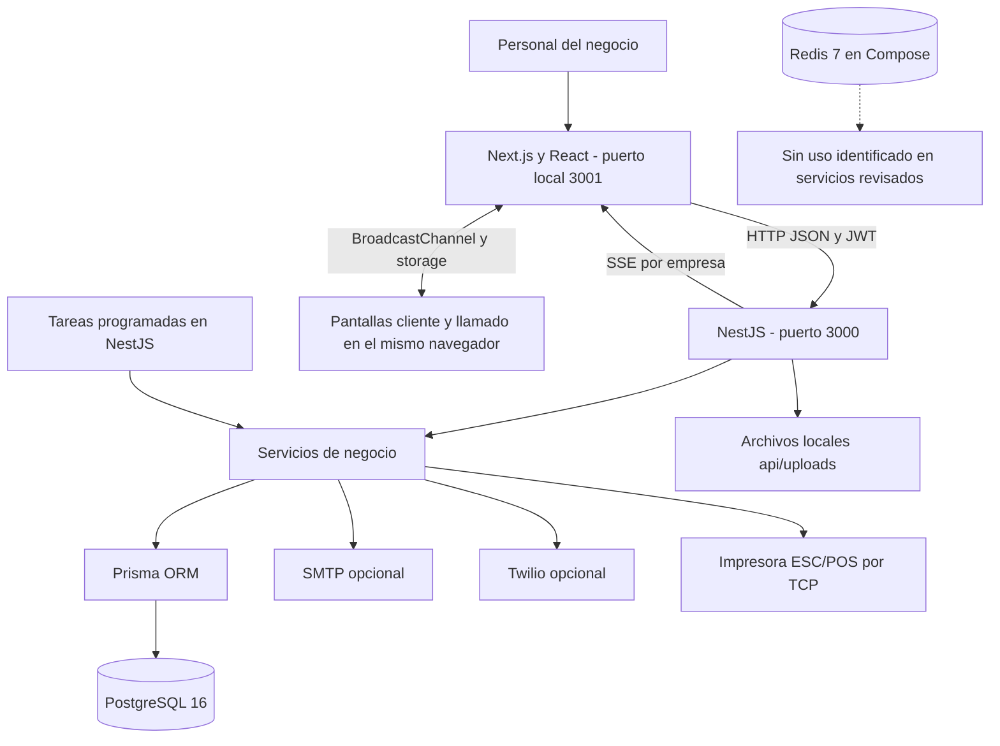
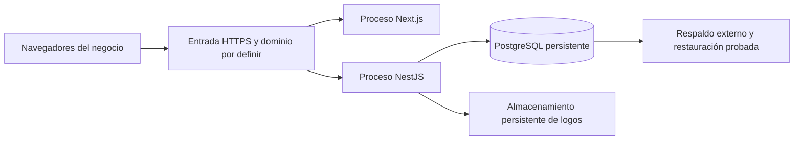

# 04. Arquitectura y diseño técnico

## Organización

PowerPOS tiene un frontend Next.js, una API NestJS organizada por módulos y persistencia PostgreSQL a través de Prisma. La API concentra lógica de negocio e integraciones. Es un backend modular único, no una arquitectura de microservicios.

## Tecnologías declaradas

| Capa | Tecnologías observadas |
| --- | --- |
| Interfaz | Next.js 16.2.9, React 19.2.4, TypeScript, Tailwind CSS 4 |
| Estado y HTTP | Zustand 5, Axios |
| Visualización | Recharts, Lucide |
| API | NestJS 11, Express, TypeScript |
| Datos | PostgreSQL 16, Prisma 5.22 |
| Identidad | Passport JWT, bcrypt; JWT con vigencia de 8 horas |
| Eventos | RxJS Subject y SSE; consultas periódicas de respaldo |
| Tareas | @nestjs/schedule |
| Integraciones | Nodemailer, Twilio, sockets TCP ESC/POS, Sharp |
| Infraestructura local | Docker Compose con PostgreSQL y Redis; aplicaciones Node separadas |
| Pruebas | Jest y Supertest en API; no script de pruebas del frontend identificado |

Versiones tomadas de manifests del repositorio. No se afirma que sean las versiones más recientes ni se efectuó auditoría de dependencias.

## Responsabilidades por componente

| Componente | Responsabilidad |
| --- | --- |
| `web/app` | Páginas de operación y administración |
| `web/components` | Navegación y controles reutilizables, teclado táctil |
| `web/lib/api.ts` | Cliente Axios, incorporación del token y manejo de 401 |
| `web/store/authStore.ts` | Sesión persistida en navegador y cierre al detectar cambio de día |
| Controladores NestJS | Rutas, extracción de parámetros y guards declarados |
| Servicios NestJS | Reglas operativas y acceso a datos |
| `api/src/prisma` | Cliente compartido de base de datos |
| `api/prisma/migrations` | Evolución del esquema |
| `api/uploads` | Logos publicados como `/uploads/` |

## Autenticación y autorización

Login compara bcrypt y emite JWT con `sub`, `email`, `rol`, `empresaId` y `sucursalId`. La estrategia acepta Bearer y también `token` en query, utilizado por SSE. El token se guarda en localStorage. Un 401 lleva al login.

RolesGuard interpreta decoradores Roles. Si no existe restricción de roles, permite continuar. Varios controladores solo usan JwtAuthGuard. Los permisos JSON y los filtros de navegación no equivalen a autorización de backend. La matriz real de decoradores se incluye en el catálogo de API.

## Separación de empresas

Parte de las consultas usa `empresaId` del token, de forma directa o mediante sucursal. Las claves foráneas por sí solas no garantizan que dos entidades relacionadas pertenezcan a la misma empresa. Ingrediente carece de empresaId; clientes por ID y operaciones de caja requieren revisión adicional. Por ello no se declara aislamiento completo.

## Actualización de pantallas

- Cocina usa EventSource hacia `/pedidos/stream` y consulta cada 5 segundos.
- Dashboard, clientes y financiero usan intervalos de 10 segundos; inventario, 15 segundos.
- Los eventos del backend se filtran por empresa y viven en la memoria del proceso; no se retienen para reproducción.
- Pantalla de cliente y llamado se comunican por BroadcastChannel; llamado además usa localStorage y eventos del navegador. Requieren contextos compatibles del mismo origen/perfil; no son un canal de red entre terminales.

## Consistencia y datos históricos

Las líneas guardan precio base y los adicionales guardan nombre y precio de la venta. El nombre del producto se obtiene por relación, no por copia histórica. Venta, decremento de stock, ingreso y puntos se ejecutan separadamente. Tampoco se observó transacción global en consumo interno o lotes. Debe diseñarse una unidad transaccional antes de garantizar consistencia ante fallos.

## Despliegue previsto, todavía no acreditado

Este diagrama es una propuesta, no evidencia de un despliegue existente. Antes de aplicarlo hay que sustituir URLs localhost del frontend, configurar CORS, secretos y HTTPS, preservar archivos y revisar tareas cron. Docker Compose actual no contiene servicios para API/frontend ni proxy.

## Decisiones y consecuencias

| Decisión observada | Consecuencia |
| --- | --- |
| PostgreSQL y Prisma | Modelo y migraciones explícitos; desplegar migraciones y regenerar cliente |
| Módulos de negocio NestJS | Permite localizar controladores y servicios por función |
| Estado de sesión en navegador | Facilita navegación, exige proteger ejecución de scripts y manejar expiración |
| Eventos en memoria | Simple con un proceso; varias réplicas requieren coordinación |
| Logos en disco local | Requieren volumen persistente y respaldo aparte de PostgreSQL |
| Tareas dentro del proceso API | Ejecutan mientras API está activa; réplicas pueden duplicarlas |
| Stock único por ingrediente | No expresa stock por sucursal ni aislamiento por empresa |

## Fuentes

[Backend](../api/src/app.module.ts), [arranque](../api/src/main.ts), [eventos](../api/src/pedidos/pedidos-eventos.service.ts), [manifiesto API](../api/package.json), [manifiesto web](../web/package.json) y [Compose](../docker-compose.yml).
