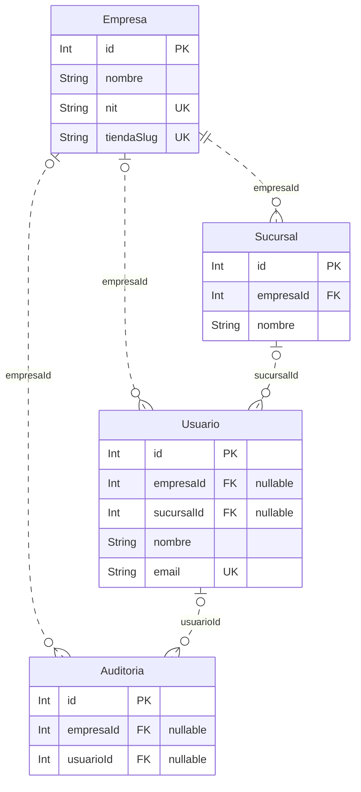
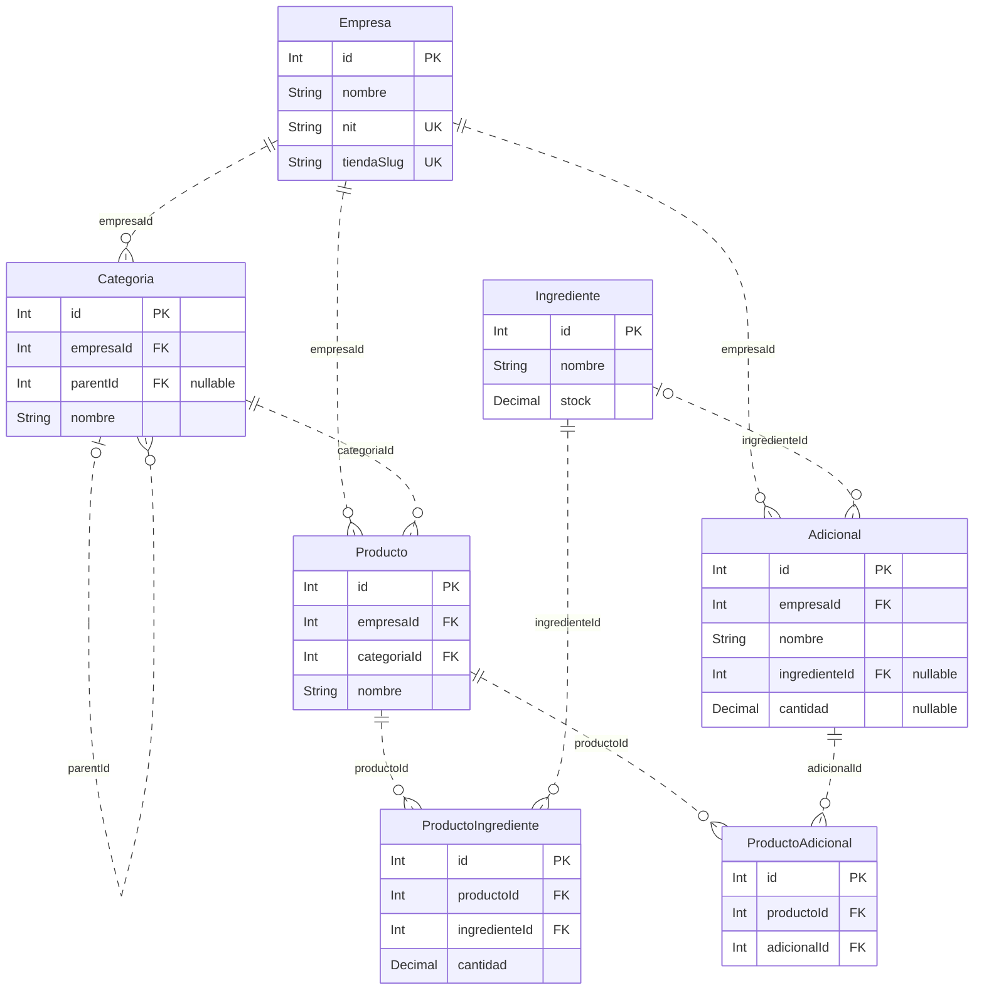
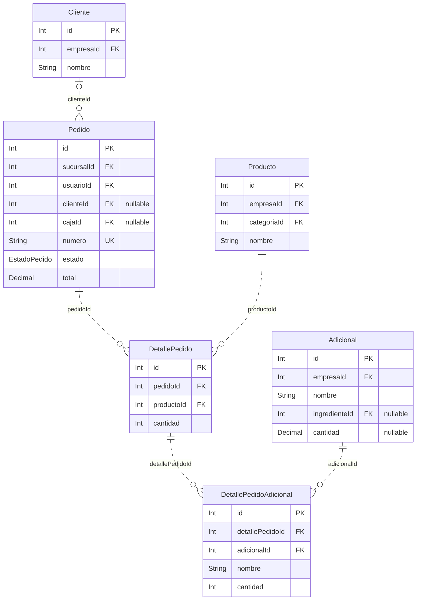
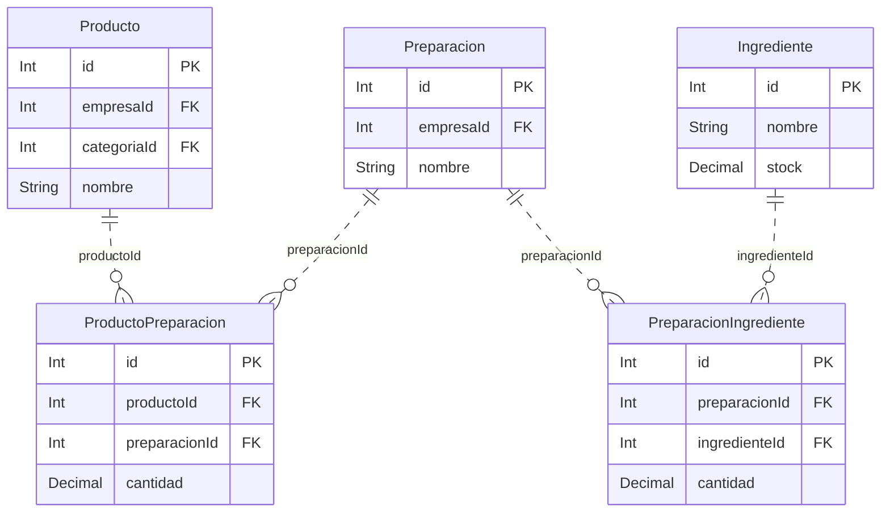
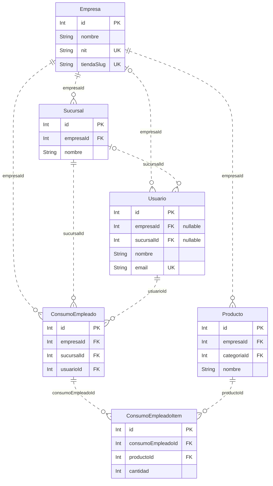
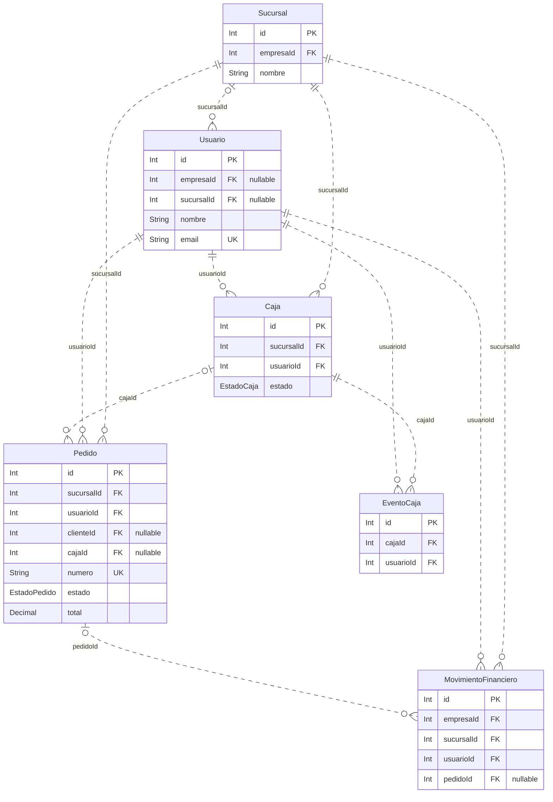
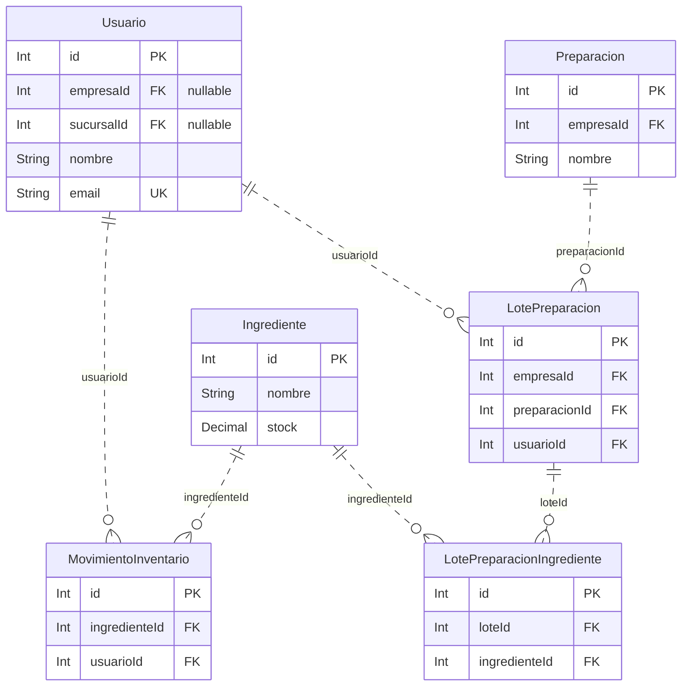

# 05. Modelo entidad-relación

Fuente: [esquema Prisma](../api/prisma/schema.prisma). Modelo físico del código actual, no un diseño idealizado.

Hay **26 entidades** y **53 relaciones con FK**. [Diagrama completo editable](diagramas/er-completo.mmd). Se muestran PK, FK, unicidad individual y algunos campos descriptivos; el [diccionario](06-diccionario-de-datos.md) incluye todos los campos y las restricciones compuestas.

## Lectura de cardinalidades

`||` significa exactamente uno; `o|` o `|o`, cero o uno; `o{`, cero o muchos. La FK obligatoria exige un padre por registro hijo, pero no obliga al padre a tener hijos. Las líneas discontinuas señalan relaciones no identificadoras: las tablas tienen PK propia. Los diagramas por dominio omiten relaciones externas al grupo; el completo y la tabla final incluyen todas.

## Organización y auditoría

[Archivo Mermaid](diagramas/er-01-organizacion.mmd)

## Catálogo, recetas y adicionales

[Archivo Mermaid](diagramas/er-02-catalogo.mmd)

## Ventas, clientes y detalles

[Archivo Mermaid](diagramas/er-03-ventas-caja.mmd)

## Recetas de preparaciones

[Archivo Mermaid](diagramas/er-04-preparaciones.mmd)

## Consumo de empleados

[Archivo Mermaid](diagramas/er-05-consumo-empleados.mmd)

## Caja y finanzas

[Archivo Mermaid](diagramas/er-06-caja-finanzas.mmd)

## Lotes y movimientos de inventario

[Archivo Mermaid](diagramas/er-07-lotes-inventario.mmd)

## Relaciones físicas completas

| Tabla hija / modelo | FK | Modelo padre / clave | Padre por hijo | Hijos por padre |
| --- | --- | --- | --- | --- |
| Sucursal | empresaId | Empresa.id | 1 | 0..N |
| Usuario | empresaId | Empresa.id | 0..1 | 0..N |
| Usuario | sucursalId | Sucursal.id | 0..1 | 0..N |
| Categoria | empresaId | Empresa.id | 1 | 0..N |
| Categoria | parentId | Categoria.id | 0..1 | 0..N |
| Producto | empresaId | Empresa.id | 1 | 0..N |
| Producto | categoriaId | Categoria.id | 1 | 0..N |
| MovimientoInventario | ingredienteId | Ingrediente.id | 1 | 0..N |
| MovimientoInventario | usuarioId | Usuario.id | 1 | 0..N |
| ProductoIngrediente | productoId | Producto.id | 1 | 0..N |
| ProductoIngrediente | ingredienteId | Ingrediente.id | 1 | 0..N |
| Preparacion | empresaId | Empresa.id | 1 | 0..N |
| PreparacionIngrediente | preparacionId | Preparacion.id | 1 | 0..N |
| PreparacionIngrediente | ingredienteId | Ingrediente.id | 1 | 0..N |
| LotePreparacion | empresaId | Empresa.id | 1 | 0..N |
| LotePreparacion | preparacionId | Preparacion.id | 1 | 0..N |
| LotePreparacion | usuarioId | Usuario.id | 1 | 0..N |
| LotePreparacionIngrediente | loteId | LotePreparacion.id | 1 | 0..N |
| LotePreparacionIngrediente | ingredienteId | Ingrediente.id | 1 | 0..N |
| ProductoPreparacion | productoId | Producto.id | 1 | 0..N |
| ProductoPreparacion | preparacionId | Preparacion.id | 1 | 0..N |
| Adicional | empresaId | Empresa.id | 1 | 0..N |
| Adicional | ingredienteId | Ingrediente.id | 0..1 | 0..N |
| ProductoAdicional | productoId | Producto.id | 1 | 0..N |
| ProductoAdicional | adicionalId | Adicional.id | 1 | 0..N |
| Cliente | empresaId | Empresa.id | 1 | 0..N |
| Pedido | sucursalId | Sucursal.id | 1 | 0..N |
| Pedido | usuarioId | Usuario.id | 1 | 0..N |
| Pedido | clienteId | Cliente.id | 0..1 | 0..N |
| Pedido | cajaId | Caja.id | 0..1 | 0..N |
| DetallePedido | pedidoId | Pedido.id | 1 | 0..N |
| DetallePedido | productoId | Producto.id | 1 | 0..N |
| DetallePedidoAdicional | detallePedidoId | DetallePedido.id | 1 | 0..N |
| DetallePedidoAdicional | adicionalId | Adicional.id | 1 | 0..N |
| Caja | sucursalId | Sucursal.id | 1 | 0..N |
| Caja | usuarioId | Usuario.id | 1 | 0..N |
| EventoCaja | cajaId | Caja.id | 1 | 0..N |
| EventoCaja | usuarioId | Usuario.id | 1 | 0..N |
| MovimientoFinanciero | empresaId | Empresa.id | 1 | 0..N |
| MovimientoFinanciero | sucursalId | Sucursal.id | 1 | 0..N |
| MovimientoFinanciero | usuarioId | Usuario.id | 1 | 0..N |
| MovimientoFinanciero | pedidoId | Pedido.id | 0..1 | 0..N |
| ConsumoEmpleado | empresaId | Empresa.id | 1 | 0..N |
| ConsumoEmpleado | sucursalId | Sucursal.id | 1 | 0..N |
| ConsumoEmpleado | usuarioId | Usuario.id | 1 | 0..N |
| ConsumoEmpleadoItem | consumoEmpleadoId | ConsumoEmpleado.id | 1 | 0..N |
| ConsumoEmpleadoItem | productoId | Producto.id | 1 | 0..N |
| Auditoria | empresaId | Empresa.id | 0..1 | 0..N |
| Auditoria | usuarioId | Usuario.id | 0..1 | 0..N |
| PedidoWeb | empresaId | Empresa.id | 1 | 0..N |
| PedidoWeb | pedidoId | Pedido.id | 0..1 | 0..N |
| PedidoWeb | sucursalId | Sucursal.id | 1 | 0..N |
| PedidoWeb | repartidorId | Usuario.id | 0..1 | 0..N |

## Decisiones y limitaciones del modelo

- Las tablas puente resuelven relaciones muchos a muchos; ProductoIngrediente, ProductoAdicional y ProductoPreparacion impiden pares duplicados mediante claves únicas compuestas.
- Categoria contiene una autorrelación opcional parentId. La FK no evita ciclos jerárquicos por sí misma.
- Usuario puede no tener empresa ni sucursal; esto permite representar SUPERADMIN, aunque el esquema no limita esa excepción a ese rol.
- Ingrediente no tiene empresaId ni sucursalId: su stock es global. MovimientoInventario tampoco tiene FK directa a empresa o sucursal.
- Pedido pertenece a empresa a través de Sucursal; ConsumoEmpleado y MovimientoFinanciero guardan empresa y sucursal, pero sus FKs independientes no aseguran coincidencia empresarial.
- Auditoria.entidadId es una referencia lógica polimórfica, no una FK a cada entidad auditada.
- ConsumoEmpleado.empleadoNombre es texto; usuarioId identifica quién registra. No existe entidad Empleado.
- DetallePedido.exclusiones es un arreglo de nombres, no una tabla de relación con Ingrediente.
- LotePreparacion no tiene saldo consumido, caducidad ni vínculo de asignación a ventas.
- No hay entidades de factura electrónica, impuestos de línea, pagos múltiples por pedido ni stock por sucursal.
- Activo y disponible expresan estados diferentes; desactivar no equivale a borrar físicamente.
- No se declararon onDelete explícitos en estas relaciones. Este documento no atribuye borrado en cascada; revisar las migraciones antes de cualquier eliminación.
