# Manual de operación de PowerPOS Pioneers

Versión documental 1.1 · 16 de septiembre de 2026 · Edición para piloto y futuras empresas adquirentes.

Este manual explica qué hace cada pantalla, quién la utiliza, qué datos ingresar, qué resultado comprobar y cómo actuar ante un problema. Está dirigido al administrador, gerente, cajero y personal de cocina. La primera implantación será un piloto en una empresa; la expansión a otras empresas requiere validar previamente la separación de sus datos.

Las capturas muestran **la interfaz real del proyecto con datos de demostración interceptados en el navegador**. No contienen clientes reales y no constituyen evidencia de operaciones guardadas. Las pruebas con servicios y base de datos real, ejecutadas separadamente, se describen en el informe de validación. El sistema todavía no está desplegado.

## 1. Cómo utilizar este manual

Para aprender a vender, siga las secciones 3, 5, 6 y 7. Para cocina, consulte la 8. El administrador debe revisar catálogo, inventario, usuarios, cierre y procedimientos de contingencia. Antes del primer día de operación, complete la [guía del piloto](plan-piloto-y-capacitacion.md).

Los nombres en negrita corresponden a controles o pantallas de la interfaz revisada. Un icono de lápiz suele editar, la papelera retira o desactiva y los símbolos +/− cambian cantidades; compruebe el mensaje de confirmación antes de actuar. Los importes de ejemplo no definen precios, moneda contractual ni condiciones comerciales.

## 2. Funciones y responsabilidades

| Perfil | Trabajo previsto | Qué debe verificar |
| --- | --- | --- |
| Administrador de empresa | Catálogo, usuarios, sucursales, inventario, caja y seguimiento | Datos iniciales, responsables y conciliación |
| Gerente | Supervisar operación, caja, reportes y consumos internos | Diferencias y excepciones del turno |
| Cajero | Armar pedido, asociar cliente y registrar método de pago | Caja asignada, cantidades, total y confirmación |
| Cocinero | Leer comanda, iniciar preparación y marcar listo | Exclusiones, adicionales, cantidad y observación |
| Domiciliario | Rol existente con acceso de API a pedidos | No hay pantalla específica de rutas/reparto; no ofrecerla como módulo terminado |
| Superadministrador del proveedor | Alta y configuración global de empresas | No entregar esta cuenta al personal de un negocio |

Esta distribución es el procedimiento recomendado. La protección técnica de roles no es uniforme en todas las rutas: el proveedor debe corregir y probar los controles pendientes antes de acreditar permisos completos.

### Mapa de navegación

| Menú o pantalla | Función principal | Resultado |
| --- | --- | --- |
| POS | Registrar pedido y medio de pago | Pedido numerado |
| Dashboard | Resumen, caja y pedidos recientes | Seguimiento y cierre |
| Cocina | Preparación | Pedido marcado listo |
| Productos | Categorías, productos, recetas y adicionales | Catálogo disponible en POS |
| Inventario | Insumos, stock, ajustes y preparaciones | Saldos e historial |
| Clientes | Datos, historial y puntos | Cliente identificable al vender |
| Financiero | Ingresos y egresos | Resumen de movimientos registrados |
| Reportes | Comparativos, empleados, clientes y rentabilidad | Información administrativa |
| Config | Empresa, perfil, usuarios y sucursales | Configuración del negocio |
| Consumo staff | Alimentación o consumo interno habilitado | Descuento de receta sin venta |
| Pantalla del cliente / llamado | Información en pantalla auxiliar | Resumen o aviso de pedido listo |

El menú del cajero muestra POS. Las opciones de otros perfiles dependen del rol, permisos y capacidades. La ausencia de un botón no prueba que una ruta esté protegida.

## 3. Iniciar sesión y usar el teclado táctil

**Antes:** disponer de una cuenta individual y de la dirección que se asignará en el despliegue. Este manual no presupone una URL pública.

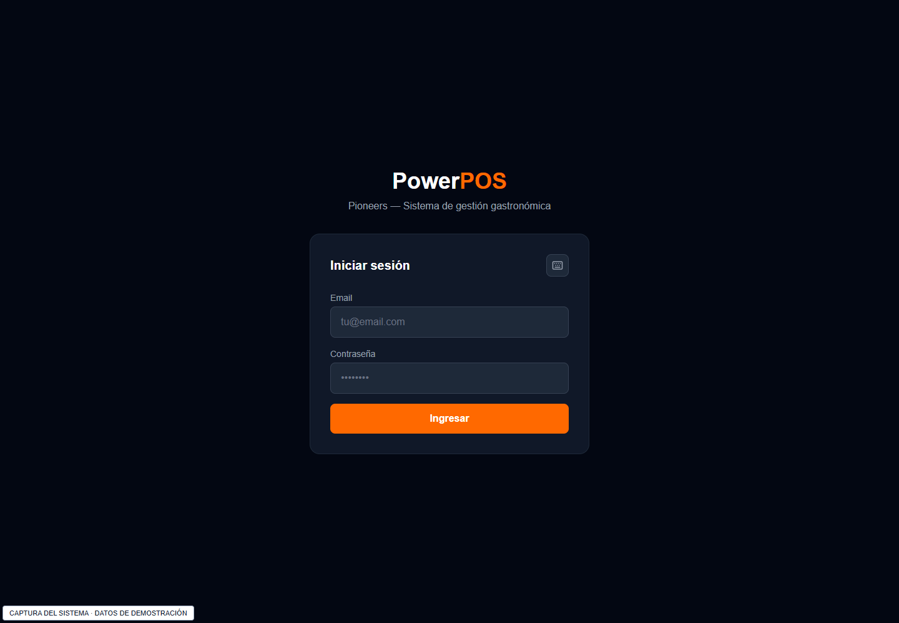

1. Abrir el acceso suministrado por el proveedor cuando se implante el piloto.
2. Escribir **Email** y **Contraseña**, respetando mayúsculas y caracteres.
3. Si el puesto es táctil, pulsar el icono de teclado junto a **Iniciar sesión**. Elegir el campo que desea completar y usar el teclado mostrado.
4. Pulsar **Ingresar** una vez.
5. Verificar nombre de empresa y usuario en la pantalla de destino.

**Resultado esperado:** administrador/gerente entra a Dashboard, cajero a POS y cocinero a Cocina. El superadministrador entra a su panel global. La sesión del backend dura ocho horas; la aplicación también puede cerrar sesión al detectar cambio de día.

**Si falla:** revisar los datos, estado de usuario/empresa y conexión con el administrador. El mensaje genérico de credenciales también puede aparecer ante fallos de conexión; no cambiar la contraseña repetidamente sin diagnóstico. No existe una pantalla de recuperación por correo identificada en la versión revisada.

**Al terminar:** cerrar sesión con el icono de salida. No dejar una sesión administrativa en el puesto de caja.

## 4. Leer el Dashboard

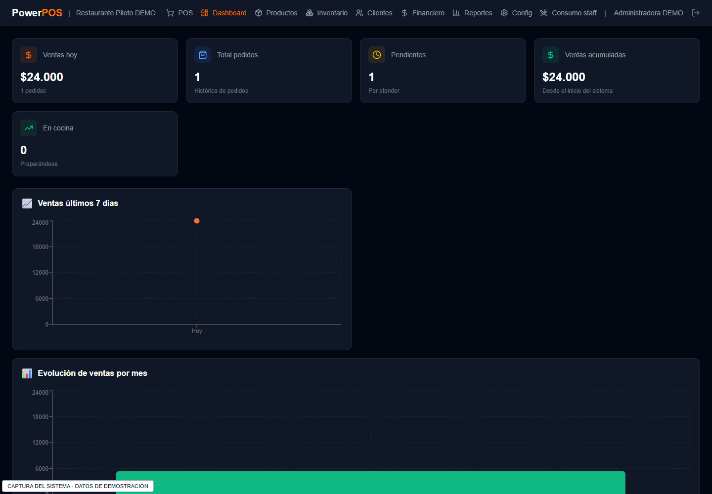

El Dashboard reúne indicadores de venta, gráficos, caja, alertas y pedidos recientes. La información se vuelve a consultar periódicamente; espere actualización antes de repetir una operación.

| Elemento | Interpretación | Acción |
| --- | --- | --- |
| Ventas y pedidos del día | Importes y cantidad correspondientes a la fecha del sistema | Revisar fecha/hora de la instalación |
| Pendientes / en cocina | Pedidos que todavía requieren preparación | Coordinar con cocina |
| Gráficos | Tendencias por día, mes, producto, categoría o pago según panel | Comparar períodos equivalentes |
| Caja | Responsable, base, ventas y total esperado | Abrir/cerrar según procedimiento |
| Alertas | Eventos que necesitan revisión | Registrar responsable y solución |
| Pedidos recientes | Últimos pedidos y estado | Buscar una operación antes de reintentar |

El listado de pedidos de API devuelve hasta 50 recientes. No asumir que la pantalla muestra todo el historial. El selector de estado de Dashboard puede cambiar un pedido a ANULADO, pero no revierte su inventario, puntos ni ingreso: aplicar el procedimiento de excepciones.

## 5. Apertura de caja

**Responsable previsto:** administrador o gerente. **Antes:** usuario y sucursal correctos, base física contada y cajero seleccionado.

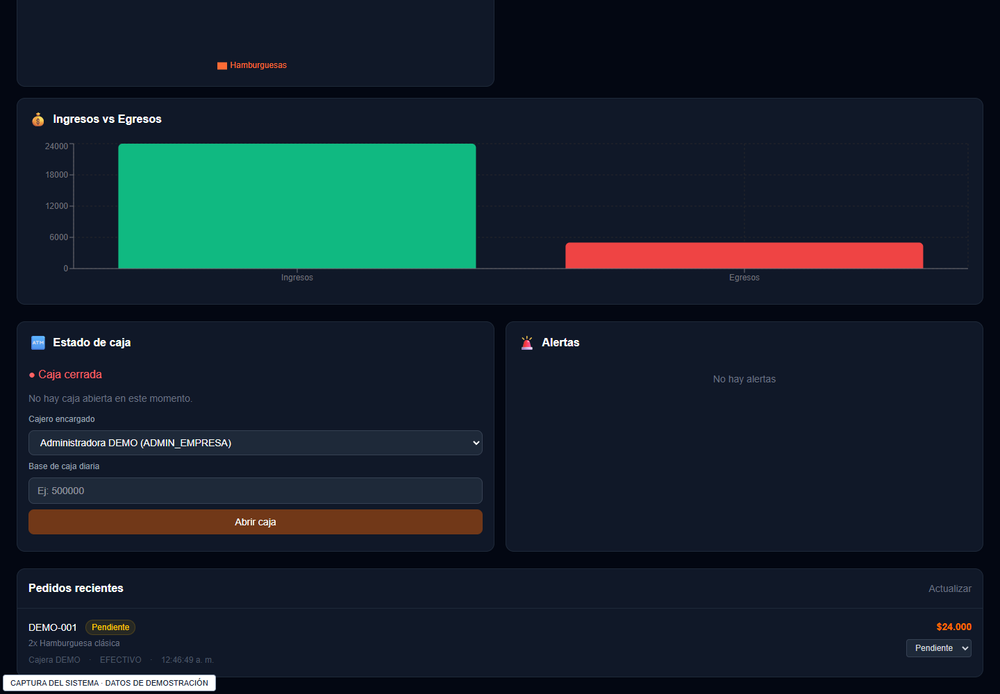

1. Entrar a **Dashboard** y localizar el panel de caja.
2. En **Cajero encargado**, seleccionar a la persona que registrará ventas.
3. En **Base de caja diaria**, escribir el importe contado, por ejemplo `50000`.
4. Pulsar **Abrir caja**.
5. Comprobar que aparece caja abierta con responsable y base correctos.

**Resultado:** queda una sesión de caja asociada a sucursal y responsable. La base inicial no genera ingreso de venta. El sistema rechaza una segunda apertura secuencial si ya hay una caja abierta.

**Si no permite vender:** confirmar que el usuario del POS sea el asignado a la caja o un supervisor. Si la apertura no se refleja, consultar estado antes de repetir. La interfaz presenta la apertura como tarea del administrador; aún se debe verificar su restricción efectiva en API.

**Horario actual:** el código revisa cajas cada cinco minutos y cierra fuera de lunes a viernes 15:00–22:00 o fines de semana 12:00–22:00, según hora local del servidor. El piloto no debe comenzar hasta acordar y comprobar ese comportamiento para el negocio.

## 6. Preparar un pedido en POS

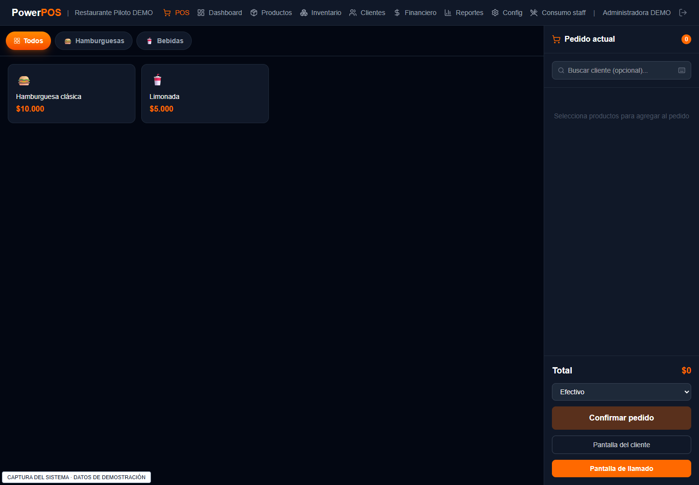

**Antes:** caja abierta y asignada, productos con precio correcto, cliente preparado para confirmar selección.

1. Entrar a **POS**.
2. Seleccionar la categoría y, si corresponde, subcategoría.
3. Pulsar el producto para abrir su personalización.
4. Revisar ingredientes, extras, cantidad y observación.
5. Agregarlo al pedido con el botón de confirmación del cuadro.
6. Revisar la línea en el carrito. Usar **+** o **−** para ajustar cantidad y la papelera para retirarla antes de confirmar.
7. Repetir para los demás productos.

### Exclusiones y adicionales

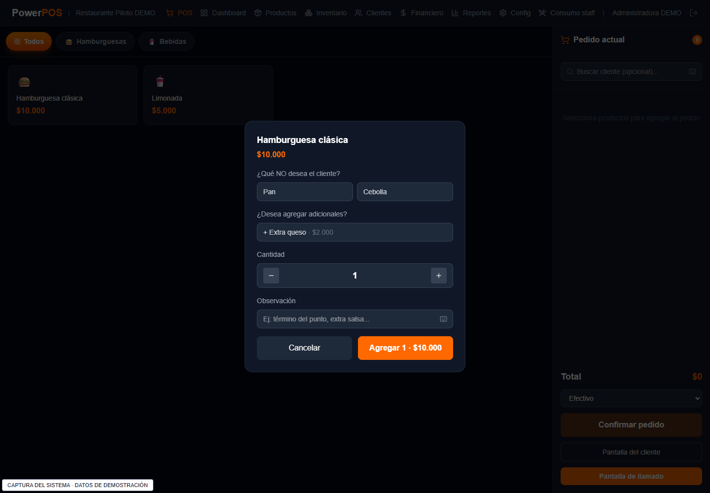

Una exclusión indica un ingrediente que el cliente no quiere; aparece como **Sin** en el pedido y cocina. Un adicional es un extra con precio; puede consumir un ingrediente. Revise ambos con el cliente antes del cobro.

Si un producto tiene una lista de adicionales asignados, se usa esa lista disponible. Si no tiene lista y acepta adicionales, el código permite el catálogo disponible de la empresa. Para una bebida sin extras, desactivar **Acepta adicionales** y revisar que no queden asociaciones contradictorias.

La observación describe preparación, por ejemplo «para llevar» o «sin salsa». Es texto para la operación: no cambia automáticamente receta ni precio. Para no consumir un ingrediente debe usarse la exclusión correspondiente, no solo escribir una nota.

### Asociar cliente

1. En **Buscar cliente (opcional)**, escribir parte del nombre, teléfono o documento.
2. Elegir el resultado correcto.
3. Verificar el nombre asociado y los puntos que se muestran como estimación.
4. Si no existe, crearlo desde **Clientes** mediante personal autorizado y volver a seleccionarlo.

No crear clientes duplicados para resolver un error de búsqueda. La venta puede registrarse sin cliente; en ese caso no suma puntos a una persona.

### Ejemplo completo de importe

| Concepto | Cálculo | Importe |
| --- | --- | --- |
| Hamburguesa clásica | 2 × 10000 | 20000 |
| Extra queso por hamburguesa | 2 × 1 × 2000 | 4000 |
| Total sin descuento | 20000 + 4000 | 24000 |
| Puntos si se asocia cliente | parte entera de 24000 / 1000 | 24 |

El campo de descuento existe en API, pero no se identificó un control de descuento en el POS revisado. No enseñar al cajero un botón que no está presente. Las pruebas técnicas de descuento se ejecutaron directamente sobre el servicio.

## 7. Confirmar, cobrar y obtener comprobante

1. Confirmar con el cliente productos, cantidades, modificaciones y total.
2. Seleccionar **Efectivo**, **Tarjeta**, **Nequi**, **Daviplata** o **Transferencia**, según el pago realmente recibido.
3. Verificar el cobro externo cuando corresponda. PowerPOS registra la clasificación, pero no cobra al banco ni verifica la transferencia.
4. Pulsar **Confirmar pedido** una sola vez y esperar.
5. Comprobar el número y total del pedido en el resultado y, si hay duda, en Dashboard.
6. Revisar recibo, comanda y cajón conforme al equipo habilitado.

**Efectos normales:** pedido y detalles guardados, receta no excluida descontada, adicionales consumidos, ingreso financiero creado, puntos sumados si aplica y aviso de pedido a cocina.

**Fallo después de confirmar:** no repetir de inmediato. Puede haberse guardado el pedido antes del error. Anotar hora, usuario, total y cliente; buscar pedido y pedir conciliación al supervisor. La versión revisada no garantiza una transacción única para todos esos efectos.

**Impresión:** comprobar encendido, papel y conexión del equipo. Un recibo no impreso no significa que la venta falló. No duplicar venta para obtener una copia; el proveedor debe definir el mecanismo de reimpresión disponible en la instalación. No se documenta un botón de reimpresión inexistente.

## 8. Cocina y entrega al cliente

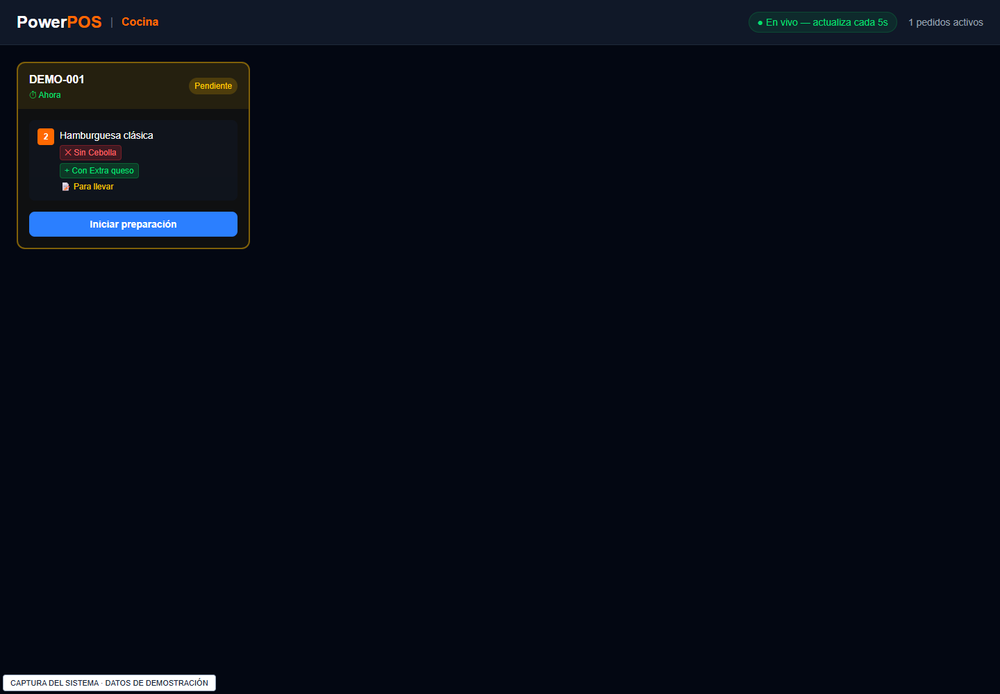

**Responsable:** cocinero. **Antes:** pedido confirmado por caja.

1. Leer el número, tiempo, cantidades, exclusiones en rojo y extras en verde.
2. Revisar observaciones antes de preparar.
3. En un pedido pendiente, pulsar **Iniciar preparación**.
4. Cuando termine, pulsar **Marcar como listo**.
5. Coordinar la entrega con personal autorizado.

La pantalla de cocina revisada muestra los pedidos de preparación; **ENTREGADO** se puede registrar desde el selector del Dashboard. No hay un botón de entrega en las tarjetas de cocina mostradas. El cambio a LISTO puede retirar el pedido de esa lista: verificar su estado en Dashboard si se necesita seguimiento.

| Estado | Significado operativo |
| --- | --- |
| Pendiente | Pedido recibido, preparación no iniciada |
| En cocina | Preparación en curso |
| Listo | Preparación terminada |
| Entregado | Recibido por el cliente según registro del personal |
| Anulado | Estado de cancelación; sus efectos no se compensan automáticamente |

El sistema no impone todas las transiciones de negocio. No volver a estados anteriores para «arreglar» cobros o inventario.

## 9. Pantallas de cliente y llamado

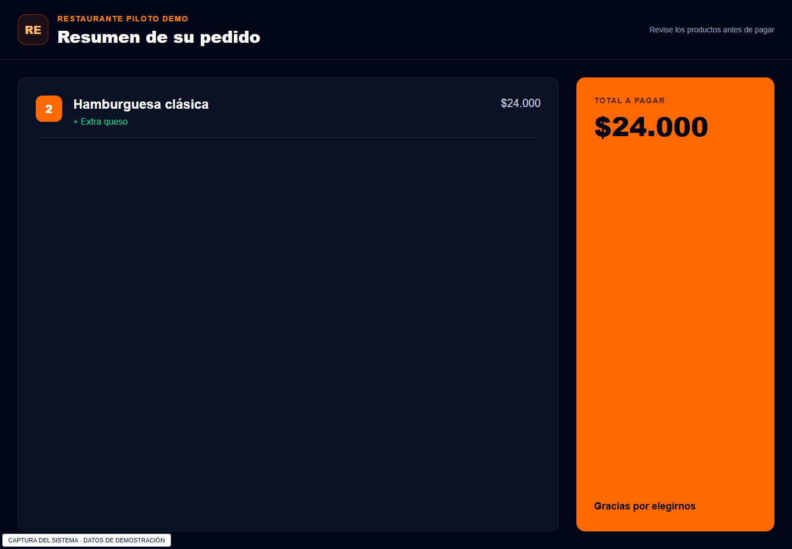

En POS, pulsar **Pantalla del cliente** para abrir una ventana auxiliar. Llevarla al monitor visible al comprador y revisar que muestre productos e importe al actualizar el carrito.

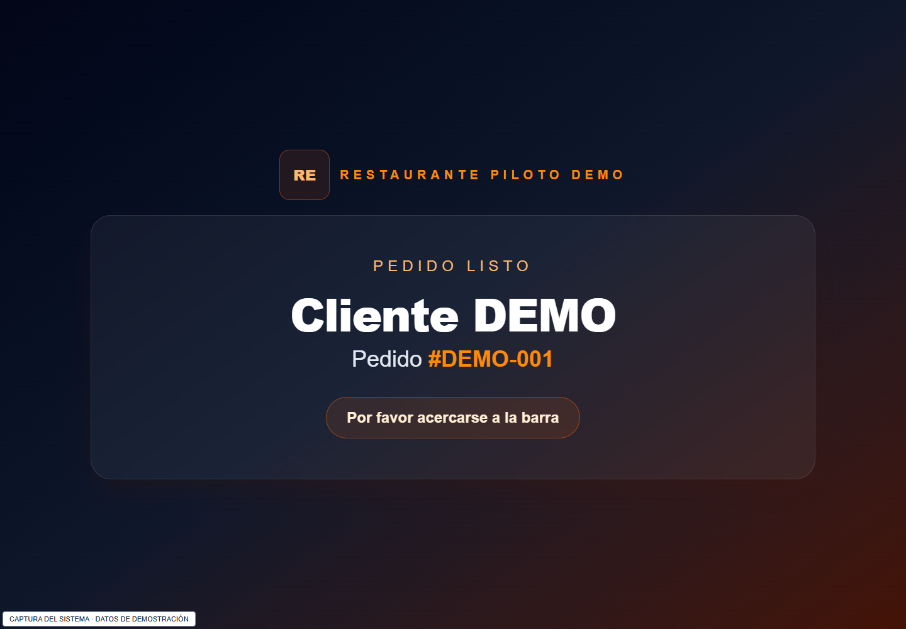

Pulsar **Pantalla de llamado** para abrir el aviso de pedidos listos. Al marcar listo un pedido asociado a un cliente, comprobar nombre y número. La voz depende del navegador y sus condiciones de reproducción.

**Condición de funcionamiento:** estas pantallas usan comunicación entre ventanas del mismo origen y entorno de navegador. No funcionan automáticamente como pantallas remotas en otro computador. Probar el puesto real de caja/cocina/monitor antes de ofrecerlo al cliente. Permitir ventanas emergentes para la aplicación cuando el navegador lo solicite.

## 10. Categorías y subcategorías

**Responsable previsto:** administrador. En **Productos**, abrir la creación de categoría.

| Campo | Qué ingresar |
| --- | --- |
| Nombre | Grupo reconocible, por ejemplo Hamburguesas |
| Pertenece a | Categoría principal o categoría padre |
| Ícono | Símbolo para identificar el grupo |
| Color | Color de presentación |

Guardar y comprobar que la categoría aparece en catálogo/POS. Para cambiarla, usar edición. Antes de eliminar/desactivar, revisar los productos que la utilizan y el mensaje mostrado. No crear jerarquías circulares ni utilizar una categoría hija como sustituto de una receta.

## 11. Crear y mantener productos

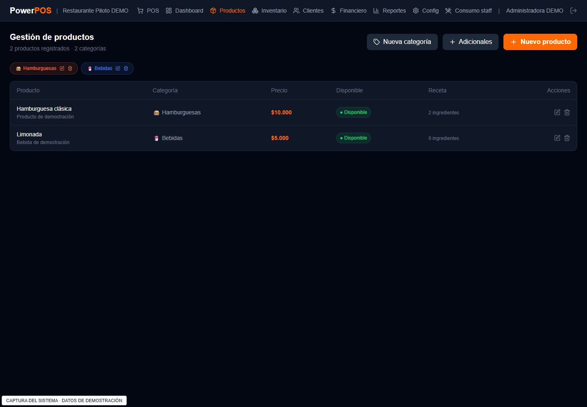

1. Entrar a **Productos** y pulsar **Nuevo producto**.
2. Completar nombre, descripción opcional, precio y categoría.
3. Definir si está **Disponible para venta** y si acepta adicionales.
4. Configurar receta por unidad vendida.
5. Marcar adicionales permitidos cuando se requiera limitar la lista.
6. Guardar y comprobar que aparece con precio/categoría correctos en POS.

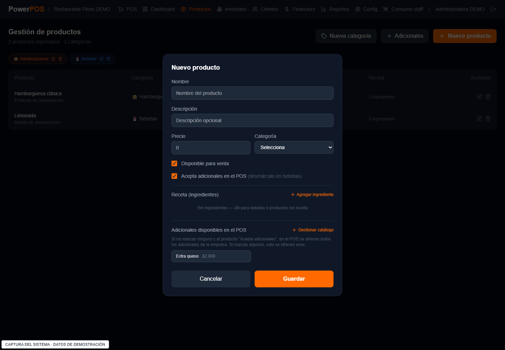

| Campo | Ejemplo y criterio |
| --- | --- |
| Nombre | Hamburguesa clásica; identificar sin ambigüedad |
| Descripción | Información descriptiva del producto |
| Precio | 10000; valor de una unidad sin extras |
| Categoría | Hamburguesas |
| Disponible para venta | Desmarcar cuando temporalmente no se puede preparar |
| Receta | 1 pan y 10 gramos de cebolla por hamburguesa, en el ejemplo |
| Adicionales | Extra queso si se ofrece ese extra |

Para editar, usar el lápiz del producto, modificar y guardar. Para una falta temporal de insumo, cambiar disponibilidad y comprobar que no pueda venderse. **Disponible** y **activo** no son lo mismo: la desactivación retira el registro del catálogo activo, pero los pedidos históricos conservan su referencia.

### Cómo definir la receta

Seleccionar ingrediente existente o crear uno desde el formulario cuando la interfaz lo permita. Especificar unidad y cantidad por unidad vendida. Si son dos hamburguesas, el consumo normal duplica esa cantidad. Evitar duplicar ingredientes por diferencias de nombre o unidad. Si el ingrediente tiene factor de compra, validar un ensayo: el servicio de pedidos aplica conversión y puede multiplicar la cantidad de receta.

Cambiar una receta afecta operaciones posteriores. No usar edición de producto para corregir un pedido ya confirmado.

## 12. Catálogo de adicionales

Desde Productos abrir **Adicionales** o **Catálogo de adicionales**, según el control mostrado.

1. Escribir nombre y precio por unidad de adicional.
2. Si debe descontar inventario, seleccionar **Ingrediente (opcional)** e indicar **Cantidad a descontar**.
3. Guardar el adicional y asignarlo a los productos adecuados.
4. Probar que se ofrece, suma al total y consume lo previsto.

Ejemplo: Extra queso cuesta 2000 y consume 20 gramos de queso. Dos hamburguesas con un extra cada una suman 4000 y consumen 40 gramos del ingrediente adicional. «Sin descuento de inventario» significa que el adicional no tiene ingrediente enlazado; no significa que sea gratuito.

Editar/desactivar mediante controles del catálogo. Los adicionales vendidos guardan nombre y precio de referencia en el detalle, por lo que cambiar el precio futuro no debe recalcular ventas anteriores.

## 13. Inventario e ingredientes

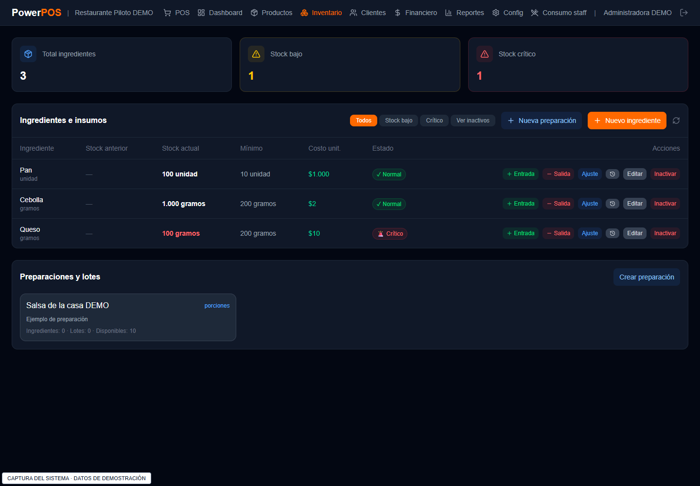

La pantalla muestra ingredientes, stock, mínimo, alertas y controles de ajuste/historial. Puede incluir inactivos y filtrar stock bajo o crítico.

### Crear un ingrediente

1. Abrir **Nuevo ingrediente**.
2. Registrar nombre, unidad de stock, stock inicial y mínimo.
3. Ingresar costo por unidad de stock si se dispone del dato.
4. Si se compra por presentación distinta, indicar unidad de compra y factor.
5. Guardar, revisar el saldo y el movimiento inicial.

| Campo | Interpretación | Ejemplo |
| --- | --- | --- |
| Unidad | Unidad en la que se mantiene el saldo | gramos |
| Stock | Cantidad existente al registrar | 1000 |
| Stock mínimo | Umbral de alerta | 200 |
| Costo por unidad | Costo correspondiente a la unidad de stock | 2 por gramo |
| Unidad de compra | Presentación adquirida | bolsa |
| Factor | Unidades de stock por presentación | 500 gramos por bolsa |

No combinar gramos, unidades y bolsas sin conversión definida. El costo debe corresponder a la unidad indicada, no al precio total de una bolsa si el campo pide costo por gramo.

### Entrada, salida y ajuste

1. Localizar el ingrediente y abrir ajuste/movimiento.
2. Elegir tipo y cantidad.
3. Marcar unidad de compra solo si la cantidad está expresada en esa presentación.
4. Escribir descripción con motivo y referencia.
5. Confirmar y comprobar saldo e historial.

| Tipo | Efecto | Con saldo inicial de 1000 |
| --- | --- | --- |
| ENTRADA 200 | Suma 200 | Saldo 1200 |
| SALIDA 200 | Resta 200 | Saldo 800 |
| AJUSTE 200 | Establece el saldo en 200 | Saldo 200 |
| ENTRADA 2 bolsas de 500 | Convierte y suma 1000 | Saldo 2000 |

**No introducir una diferencia en AJUSTE** si desea establecer el saldo contado: el valor es el saldo final. No registrar manualmente otra salida por una venta que ya descontó receta.

### Historial y alertas

Abrir historial del ingrediente y revisar tipo, cantidad, responsable, descripción y fecha. Stock bajo significa saldo menor o igual al mínimo; crítico, menor o igual a la mitad del mínimo. La consulta muestra hasta 50 movimientos recientes. Las ventas y consumos internos revisados descuentan stock directamente y no generan todos los movimientos de historial: el historial no acredita por sí solo la totalidad del consumo.

**Limitación para varias empresas:** ingredientes y stock son globales en el código actual. No habilitar un segundo negocio independiente en la misma base sin corregir y probar esa separación.

## 14. Preparaciones y lotes

En Inventario se puede crear una preparación con nombre, descripción, unidad y receta de ingredientes. Una preparación representa un componente elaborado, como una salsa.

El backend permite registrar lotes con cantidad producida, porciones e insumos usados; ese registro descuenta insumos y deja movimiento. **No se identificó un formulario completo de captura de lotes en la pantalla revisada.** El proveedor debe habilitar un flujo operativo antes de incluirlo como tarea ordinaria del cliente.

El indicador de porciones disponibles suma producción y no resta ventas. No usarlo como saldo físico final ni crear ajustes dobles de insumos/preparaciones. Para el piloto, mantener esta función fuera del alcance aceptado hasta validar su flujo completo, salvo que se acuerde expresamente solo la consulta/creación básica.

## 15. Clientes, historial y puntos

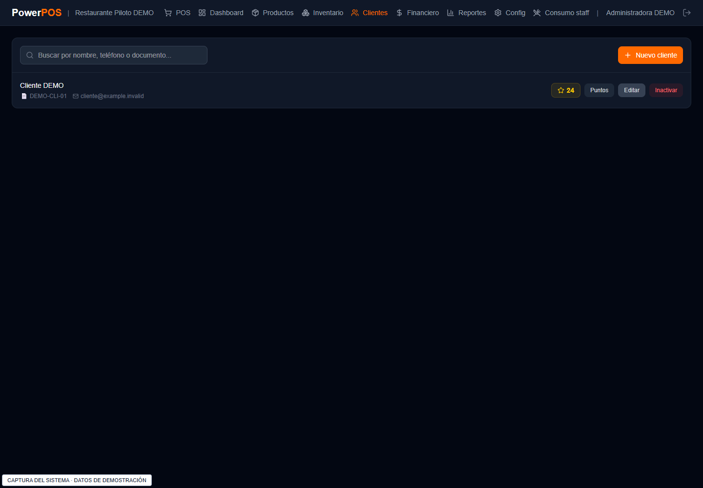

### Crear o editar cliente

1. Buscar por nombre, teléfono o documento para evitar duplicados.
2. Pulsar **Nuevo cliente**.
3. Completar nombre y los datos necesarios de identificación/contacto.
4. Registrar email, dirección o fecha de nacimiento únicamente cuando se requieran.
5. Guardar y verificar en listado.

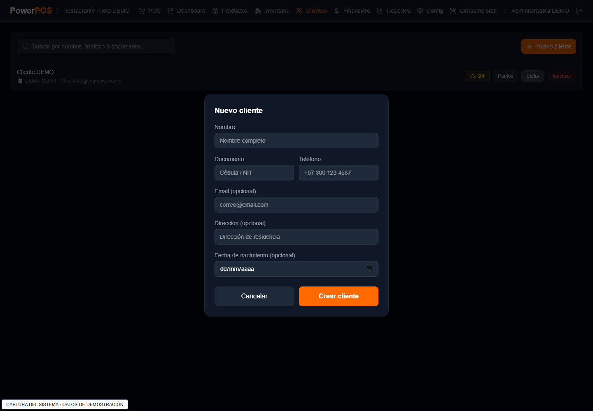

El documento identifica al cliente dentro de la empresa cuando se registra. No completar con documentos inventados para superar validaciones. La fecha de nacimiento se utiliza para tareas de cumpleaños si están configuradas.

Para modificar, usar edición, cambiar los campos y guardar. Desactivar una ficha no borra automáticamente sus compras. Abrir detalle para revisar pedidos y puntos; el historial obtenido está limitado a pedidos recientes, por lo que los totales de esa vista no deben asumirse siempre como todo el histórico.

### Administrar puntos

Abrir el control de puntos, elegir **Agregar puntos** o **Redimir puntos**, indicar una cantidad positiva y aplicar la política aprobada por el negocio. Registrar motivo externamente si la pantalla no lo solicita. Redimir puntos solo cambia el saldo de puntos: no hay equivalencia monetaria ni descuento automático acreditados en el POS.

Una venta asociada suma la parte entera de total / 1000. No repetir la asignación manual de puntos que el sistema ya sumó. Una anulación no los retira automáticamente.

## 16. Finanzas y movimientos

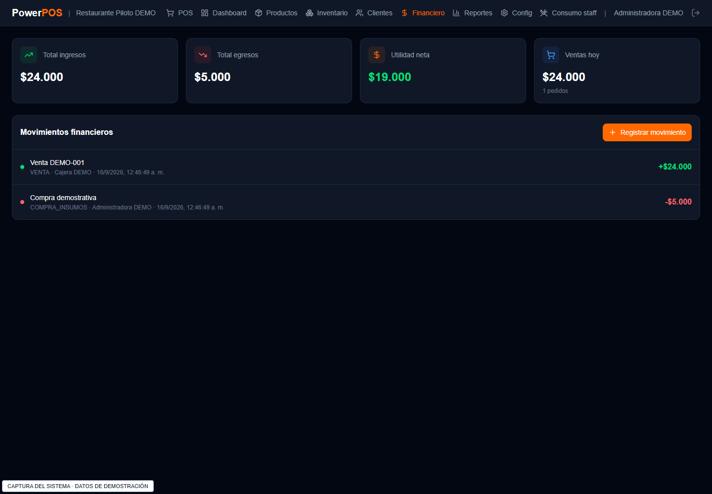

1. Entrar a **Financiero** y revisar ingresos, egresos y utilidad.
2. Para una operación manual, abrir **Registrar movimiento**.
3. Elegir tipo **Ingreso** o **Egreso**, categoría, descripción y monto positivo.
4. Confirmar y comprobar el movimiento en listado.

Categorías del modelo: VENTA, COMPRA_INSUMOS, NOMINA, SERVICIOS, ARRIENDO, MANTENIMIENTO, IMPUESTOS y OTROS. La categoría no calcula impuestos, nómina ni obligaciones; solo clasifica el registro.

Una venta del POS ya crea un ingreso. No volver a registrarla. Un egreso por compra de insumos no aumenta automáticamente existencias: registrar también la entrada de inventario cuando corresponda y conservar referencia común.

El resumen de utilidad es ingresos registrados menos egresos registrados. No incorpora por sí mismo cuentas por pagar, depreciaciones o contabilidad completa. El listado puede mostrar hasta 100 movimientos; no confundirlo con un libro completo exportado.

## 17. Reportes y lectura de indicadores

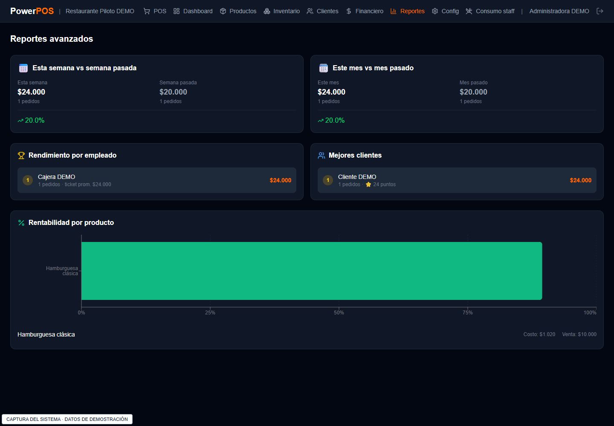

| Reporte | Qué muestra | Precaución de lectura |
| --- | --- | --- |
| Semana / mes actual frente al anterior | Totales y variación | Período actual puede estar incompleto |
| Rendimiento por empleado | Ventas, pedidos y ticket promedio | No mide desempeño laboral integral |
| Mejores clientes | Actividad de compra | Revisar filtros y período |
| Rentabilidad por producto | Precio frente a costos de receta registrados | Costos faltantes distorsionan el indicador |

Si no hay ventas o costos, la pantalla puede mostrar ausencia de datos. No completar con cifras supuestas. Las rutas de reportes diarios/mensuales/anuales existen en API, pero la página revisada consulta cuatro reportes avanzados: no se promete un selector/exportador que no esté visible.

Para conciliar, comparar mismo período, sucursal/empresa y criterio de anulaciones. Un ingreso de venta anulada puede permanecer en Financiero aunque el pedido se excluya de otros indicadores; escalar la diferencia.

## 18. Configuración de empresa, perfil y sucursales

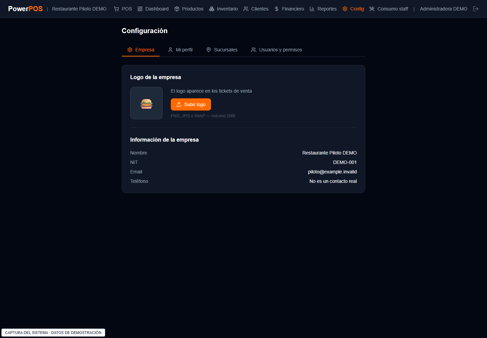

En **Config → Empresa**, consultar la información del negocio y usar **Subir logo**. La pantalla recomienda PNG, JPG o WebP y tamaño máximo de 2 MB. Elegir imagen legible y verificarla en pantalla y recibo. Los datos de empresa se muestran en esta vista; no hay formulario de edición de todos esos campos en la pantalla revisada. Solicitar al proveedor los cambios que no tengan control visible.

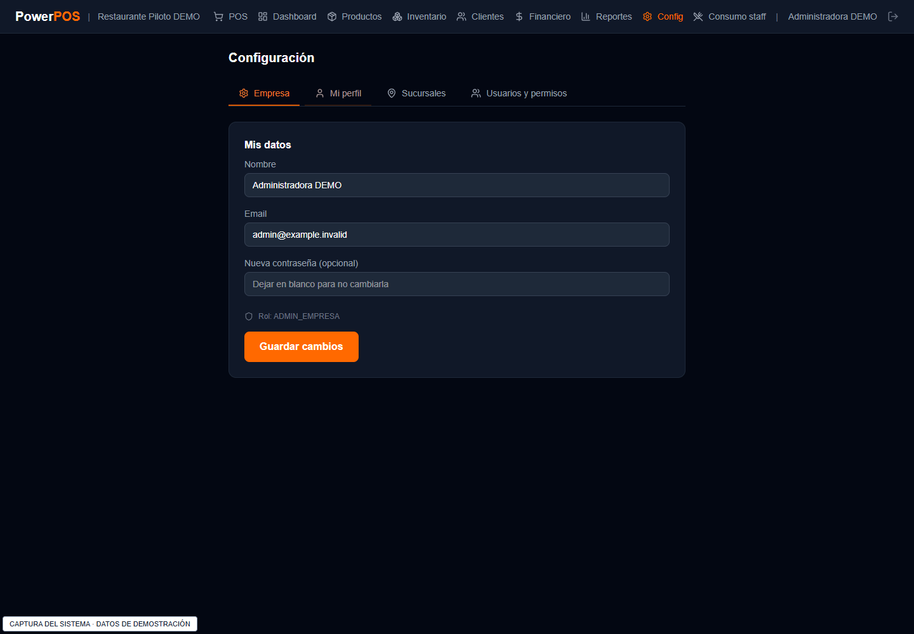

En **Mi perfil**, modificar nombre/email y, si se necesita, **Nueva contraseña (opcional)**. Dejar contraseña vacía para conservarla. Pulsar **Guardar cambios** y comprobar el resultado. No registrar la contraseña nueva en el acta ni enviarla en una captura.

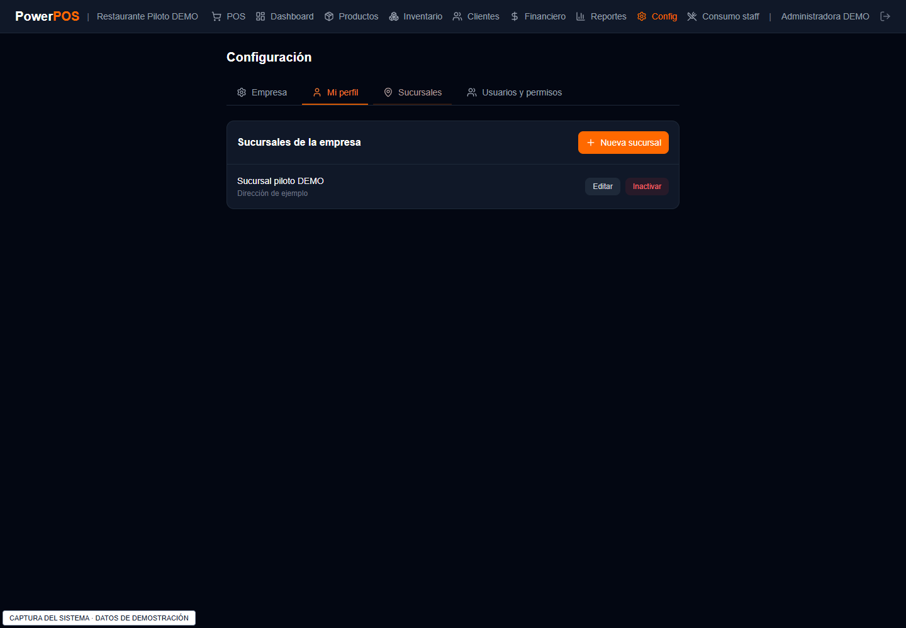

En **Sucursales**, usar **Nueva sucursal**, ingresar nombre y datos de contacto/dirección y guardar. Usar edición para corregir datos. Antes de desactivar, revisar usuarios y operación pendiente. Sucursal es un local de una empresa; no utilizarla para representar otra empresa independiente y evadir aislamiento.

## 19. Usuarios y permisos

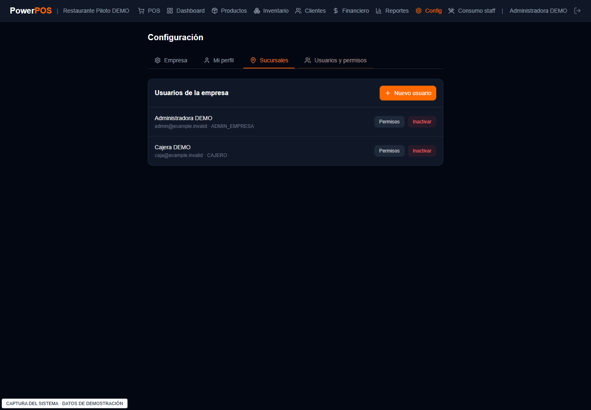

1. Entrar a **Config → Usuarios y permisos**.
2. Crear usuario con nombre, correo, contraseña inicial, rol y sucursal según formulario.
3. Entregar acceso individual por canal acordado.
4. Revisar funciones visibles con esa cuenta.
5. Ajustar permisos si el control está disponible y probar acceso efectivo.
6. Desactivar al usuario cuando deje de operar; revisar sesiones existentes con soporte.

No compartir una cuenta para varios turnos: se pierde identificación del responsable. Cambiar rol o desactivar no garantiza revocación inmediata de un JWT ya emitido; incluir esa situación en la validación de permisos. Los permisos guardados y los menús no tienen enforcement completo acreditado.

## 20. Consumo de empleados

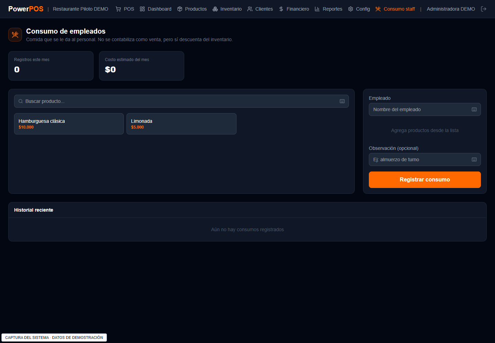

**Antes:** empresa habilitada por proveedor y usuario administrador/gerente.

1. Abrir **Consumo staff**.
2. Buscar y agregar productos consumidos; ajustar cantidad con +/− o retirar con papelera.
3. Indicar **Empleado** y verificar **Sucursal**.
4. Agregar observación opcional, por ejemplo «alimentación del turno».
5. Pulsar registro de consumo y esperar confirmación.
6. Revisar historial y el efecto en ingredientes.

No se crea venta ni ingreso financiero. El nombre del empleado es texto del registro y no necesariamente una cuenta de usuario. El costo estimado del mes usa precio de referencia de venta, no costo exacto ni deuda de la persona. No registrar el mismo alimento como consumo interno y venta, salvo que el negocio documente dos operaciones diferentes.

## 21. Cierre y conciliación de caja

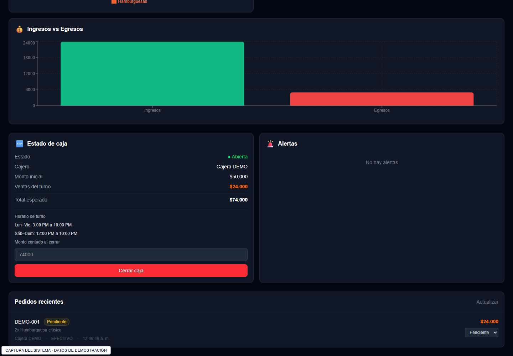

1. Detener nuevas ventas durante el conteo acordado.
2. Separar base, cobros en efectivo, cobros electrónicos y retiros/ingresos ajenos a ventas.
3. Conciliar cada medio contra pedidos y comprobantes externos.
4. Revisar incidencias, anulaciones y operaciones dudosas.
5. Completar el formato de arqueo y el criterio de monto final acordado.
6. En Dashboard escribir **Monto contado al cerrar** y pulsar **Cerrar caja**.
7. Verificar caja cerrada, diferencia y alertas; conservar firma del responsable.

### Ejemplo de cálculo actual

| Concepto | Importe |
| --- | --- |
| Base inicial | 50000 |
| Ventas en efectivo | 24000 |
| Ventas por transferencia | 10000 |
| Total esperado por la aplicación | 84000 |
| Efectivo físico esperado, sin otros movimientos | 74000 |

El cálculo actual mezcla todos los medios al formar el total esperado. Introducir solo efectivo físico produciría diferencia de −10000 en este ejemplo. **No corregir el importe para ocultar la diferencia:** el proveedor y negocio deben aprobar/probar cómo registrar el cierre o corregir el sistema antes del piloto. El [procedimiento de conciliación](procedimientos-operativos.md) incluye formato por medio.

Omitir monto puede usar automáticamente el esperado; no acredita conteo. Una diferencia absoluta superior a 1000 genera evento de alerta. El cierre automático usa monto esperado; revisar por separado conteo real.

## 22. Correcciones, anulaciones y contingencias

Antes de confirmar, corregir carrito y selección. Después de confirmar, no borrar datos ni repetir el pedido como mecanismo de corrección. Registrar incidencia y solicitar revisión del supervisor.

Se comprobó que **ANULADO no devuelve inventario ni puntos y mantiene el ingreso de la venta**. Hasta tener un procedimiento compensatorio aprobado y probado, restringir la anulación operativa y resolver cada caso con soporte. La [guía de procedimientos](procedimientos-operativos.md) define qué registrar y cuándo detener operación.

No hay modo sin conexión implementado. Si se pierde red/servicio, usar el registro de contingencia aprobado, distinguir pedidos ya guardados de pedidos pendientes y conciliar antes de ingresar información nuevamente.

## 23. Diagnóstico y solicitud de ayuda

| Síntoma | Primera comprobación | Cuándo escalar |
| --- | --- | --- |
| No ingresa | Correo, contraseña, conexión y cuenta activa | Persiste o muestra empresa incorrecta |
| POS bloqueado | Caja abierta y cajero asignado | Estado no coincide con supervisor |
| Error al confirmar | Buscar pedido por hora/importe | No se puede establecer si se guardó |
| No imprime | Papel, energía y conexión | Venta existe y no hay copia disponible |
| Cocina no actualiza | Conexión y última consulta | Pedido confirmado no aparece |
| Llamado no llega | Mismo navegador/origen y ventana abierta | Se usan equipos separados |
| Stock incorrecto | Unidad, factor, receta y operaciones recientes | Negativo o efecto no explicable |
| Caja se cierra | Horario automático y hora del servidor | No coincide con jornada acordada |
| Reportes difieren | Período y anulaciones | No se concilian movimientos |
| Función no aparece | Rol/capacidad habilitada | Fue contratada y no está disponible |

El reporte debe contener fecha/hora, empresa/sucursal, usuario sin clave, pantalla, pedido, acción y mensaje. No adjuntar tokens ni copias completas de datos. El canal y condiciones de soporte se asignarán a cada adquirente en su ficha; no hay SLA contratado por este manual.

## 24. Límites de la edición del piloto

El sistema está en preparación para una primera empresa. La facturación electrónica solo tiene una bandera de configuración, no emisión acreditada; no se ofrece como lista. Preparaciones con saldo real, reparto, pagos bancarios integrados y operación sin conexión tampoco se consideran entregados. La impresión requiere equipo real probado.

La documentación está lista como material reutilizable de capacitación. El inicio operativo exige cerrar los bloqueos del piloto y comprobar el ambiente real. Una captura o una prueba aislada aprobada no sustituye la aceptación conjunta del negocio.
