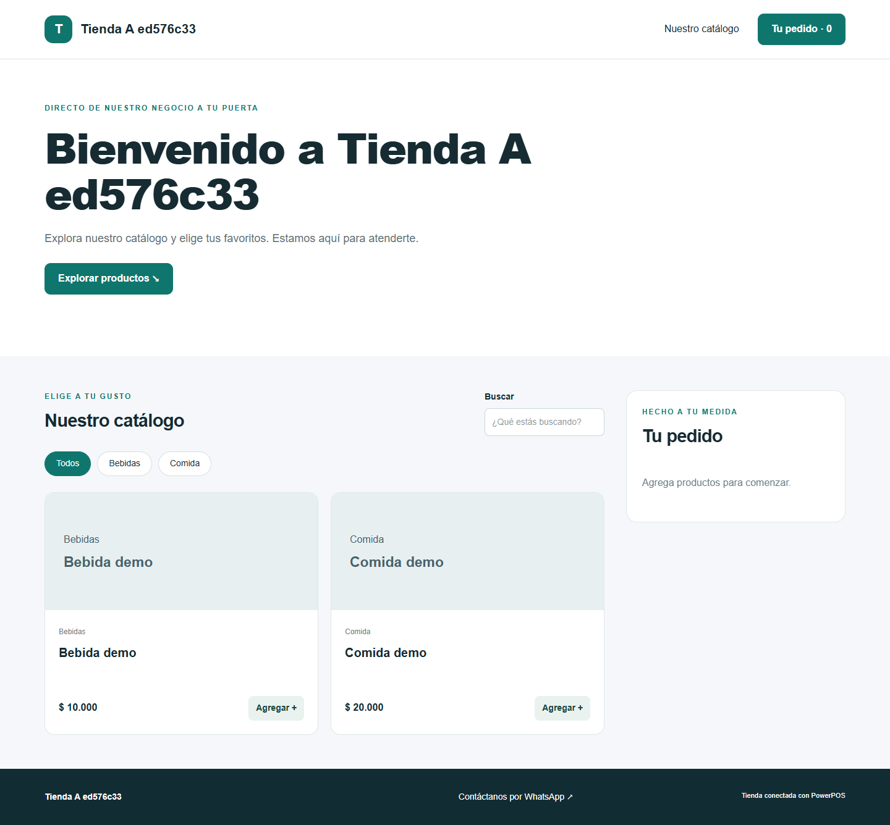
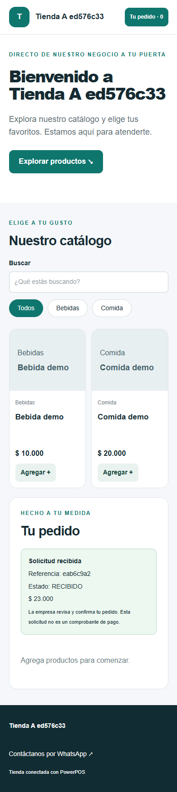
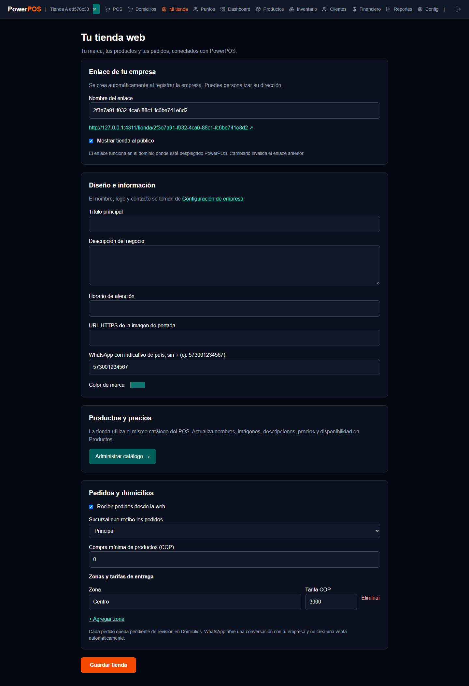
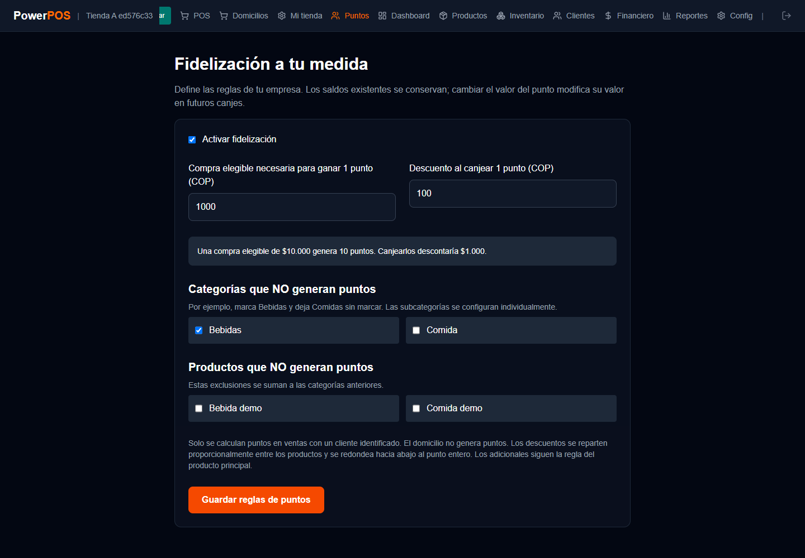
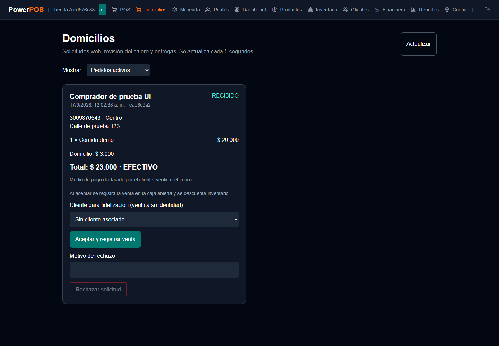

# Guía del cliente: tienda, domicilios y puntos

Versión documental 1.2 · 17 de septiembre de 2026

## Administrador: publicar y alimentar la tienda

1. Entrar a **Mi tienda**. Copiar el enlace o personalizar su identificador con letras minúsculas, números y guiones. Cambiarlo invalida enlaces anteriores.
2. En **Configuración**, guardar nombre, logo, dirección y teléfono de la empresa.
3. En **Mi tienda**, escribir título, descripción y horario; elegir color y opcionalmente una portada HTTPS.
4. Registrar el WhatsApp de esa empresa con indicativo de país, solo números.
5. Administrar categorías, productos, imágenes y precios desde **Productos**. La tienda consulta ese mismo catálogo, sin copiar precios a otra base.
6. Seleccionar sucursal receptora, definir compra mínima y zonas con tarifas.
7. Activar **Recibir pedidos desde la web**. Por defecto la página existe, pero la recepción de pedidos permanece apagada hasta configurar su operación.

Las modificaciones las autoriza el servidor según empresa y rol. Solo ADMIN_EMPRESA configura tienda y fidelización; el catálogo mantiene administración por administrador/gerente. Los precios públicos se consultan al cargar la página. Al enviar y aceptar se vuelven a comprobar en el servidor.

## Comprador: realizar un pedido

1. Abrir la tienda, buscar o filtrar productos y agregarlos al carrito.
2. Indicar nombre, teléfono, dirección, zona, forma de pago e instrucciones.
3. Revisar productos, tarifa y total, y autorizar el uso de esos datos para gestionar el domicilio.
4. Enviar. El servidor obtiene los precios de su catálogo; no utiliza precios enviados por el navegador.
5. Recibir una referencia y un enlace con `?pedido=...` que permite recuperar el seguimiento al recargar. No compartir ese enlace innecesariamente.

La solicitud no acredita un pago ni crea una venta hasta que el cajero la acepte. No se incorporó una pasarela de pagos. EFECTIVO, TRANSFERENCIA, NEQUI y DAVIPLATA son medios declarados que el negocio debe verificar.

**WhatsApp:** abre una conversación con los productos y el subtotal propuestos. No envía mensajes automáticamente ni sincroniza conversaciones con PowerPOS. El personal registra y confirma esos pedidos por su procedimiento habitual; una integración automática con WhatsApp Business requeriría credenciales y configuración adicionales.

## Cajero y domiciliario

La navegación del cajero muestra el número de solicitudes pendientes, consultado cada cinco segundos. **Domicilios** permite revisar datos, productos, total e instrucciones. El cajero ve solo su sucursal; administrador/gerente pueden revisar su empresa.

| Estado | Acción y efecto |
| --- | --- |
| RECIBIDO | Solicitud pendiente. No afecta inventario, caja, ingresos ni puntos. |
| RECHAZADO | El cajero indica un motivo. No crea una venta. |
| ACEPTADO | El cajero verifica el pedido y el medio de pago. Con caja abierta, se crea una sola venta, sus detalles, inventario, ingreso y puntos en una transacción. |
| EN_CAMINO | Se asigna un usuario DOMICILIARIO activo de la misma empresa y se despacha. |
| ENTREGADO | El domiciliario asignado o el personal autorizado confirma la entrega y se actualiza también el pedido del POS. |

El domiciliario inicia sesión en **Domicilios** y solo ve sus asignaciones. Dos aceptaciones simultáneas no producen dos ventas. Un fallo de la aceptación revierte todos sus cambios. Si el catálogo cambió respecto de la solicitud, se debe contactar al comprador antes de tramitar una nueva solicitud con el precio correcto.

La cocina puede avanzar la preparación, pero la entrega de pedidos web se confirma desde Domicilios. Rechazar una solicitud pendiente no equivale a anular una venta aceptada. Las cancelaciones posteriores a aceptación y ventas con movimientos de puntos requieren conciliación; no se implementó un flujo automático de devoluciones/reembolsos.

## Fidelización: dos valores definidos por cada empresa

Por decisión del responsable del proyecto, no existe una tarifa obligatoria ni se conserva como regla activa «1 punto por cada $1.000». El programa comienza **desactivado**, con ambos valores sin definir, y conserva los saldos históricos existentes.

En **Puntos**, el ADMIN_EMPRESA define:

- Compra elegible necesaria para ganar un punto, en COP.
- Descuento en COP que representa un punto al canjearlo.
- Categorías que no generan puntos.
- Productos que no generan puntos.

Las exclusiones se suman. Las subcategorías se seleccionan individualmente; excluir una categoría no excluye automáticamente sus hijas. Los adicionales siguen la elegibilidad de su producto principal. Los descuentos se distribuyen proporcionalmente entre las líneas. El domicilio no genera puntos ni puede pagarse con ellos. Se redondea la acumulación hacia abajo al punto entero.

**Ejemplo exclusivamente de prueba, no tarifa recomendada:** reglas de $1.000 por punto y $100 de descuento por punto. Una venta de comida por $20.000 y bebidas excluidas por $10.000 acumula 20 puntos. Canjear 10 puntos descuenta $1.000; la porción de descuento correspondiente a la comida reduce la base elegible y la venta acumula 19 puntos.

En POS, seleccionar un cliente identificado, indicar puntos a canjear y revisar el descuento. El backend verifica el saldo, registra puntos ganados/canjeados y valor aplicado en el pedido, y actualiza el saldo en la misma transacción. El canje aislado anterior en Clientes se reemplaza por canje dentro de la venta. Los ajustes positivos manuales quedan reservados al administrador.

Los compradores públicos no pueden reclamar un saldo por indicar un teléfono. Para acumular puntos en pedidos web, el cajero verifica su identidad y asocia el cliente correcto al aceptar. No se habilita consulta ni canje público de saldos sin autenticación del cliente.

Cambiar el valor monetario afecta los canjes futuros del saldo existente; no cambia los descuentos ni puntos guardados en ventas anteriores.

## Antes de ofrecer el servicio

Acordar cobertura, tarifas, horarios, responsable de revisión y cobro; configurar enlaces y probar una entrega controlada. No se habilita recepción ni fidelización con valores supuestos. La página existe al registrar la empresa, pero se publica en internet cuando se despliega PowerPOS.

## Pantallas de referencia

Las siguientes capturas provienen de pruebas de la interfaz con empresas, productos y datos ficticios. Los importes de puntos que aparecen son ejemplos configurados para el ensayo, no valores por defecto ni tarifas recomendadas.

